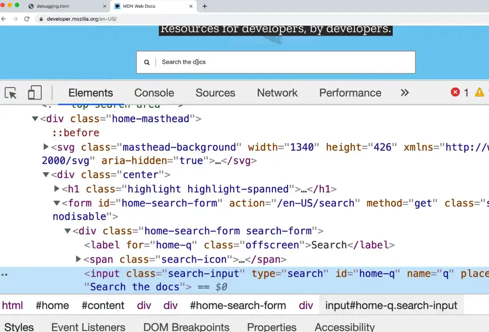
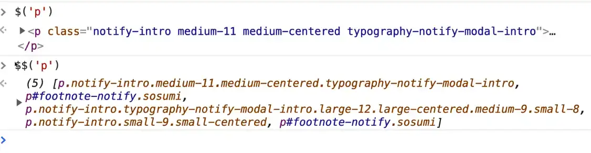
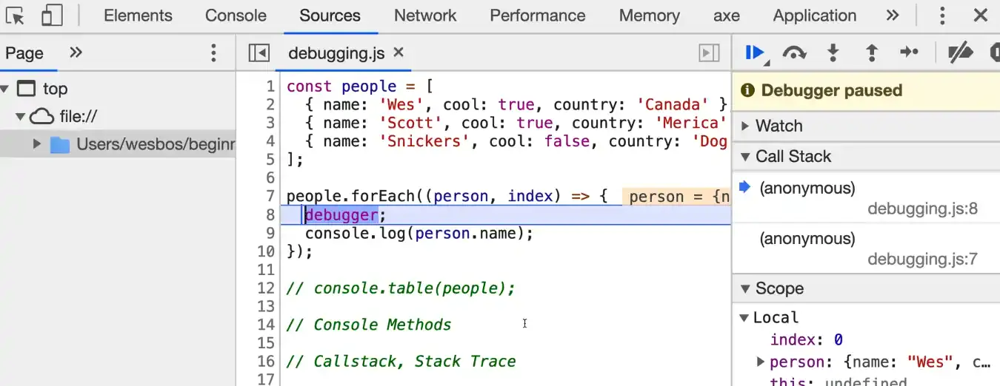

# Debugging Tools

## Console Debugging

### console.log / console.info / console.table / console.error / console.warn

```javascript
const people = [
  { name: 'Wes', cool: true, country: 'Canada' },
  { name: 'Scott', cool: true, country: 'Merica' },
  { name: 'Snickers', cool: false, country: 'Dog Country' },
];
```

```javascript
people.forEach((person, index) => {
  console.log(person.name);
  console.info(person.name);
  console.table(person);
  console.error(person.name);
  console.warn("warning");
});
```

### console.count

```javascript
function doctorize(name) {
  console.count(`running Doctorize for ${name}`);
  return `Dr. ${name}`;
}
```

### console.group

```javascript
people.forEach((person, index) => {
  console.group(`${person.name}`);
  console.log(person.country);
  console.log(person.cool);
  console.log("DONE!!");
  console.groupEnd(`${person.name}`);
});
```

### console.groupCollapsed 

```javascript
people.forEach((person, index) => {
  console.groupCollapsed(`${person.name}`);
});
```

## Grabbing Elements

clicking on it in the element inspector, if you flip over to the console and type `$0`, it will return to you whatever element you had currently selected in the elements tab.



`$('p')` will give us `document.querySelector()`, which will match the first thing that matches the selector passed.

`$$('p')` will match ALL of the elements that match the selectors.



## Breakpoints

```javascript
people.forEach((person, index) => {
  debugger;
  console.log(person.name);
});
```




[https://wesbos.com/javascript/02-functions/debugging-tools](https://wesbos.com/javascript/02-functions/debugging-tools)

