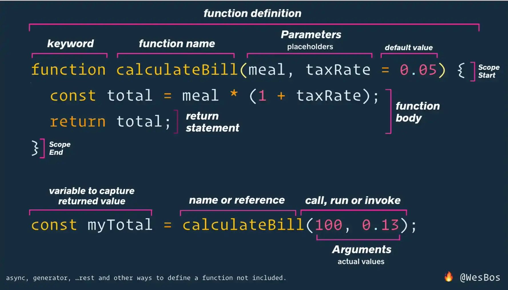

# Functions - Parameters and Arguments

延續上個自訂函式， 新增了 `bill * 税率 = total 。`

```javascript
const bill = 100;
const taxRate = 0.13;

function calculateBill() {
  console.log("Running calculate bill!!");
  const total = bill * taxRate;
  return total;
}
```

 但如果有不同的 bill 及稅率我們都要新建立函式嗎？ 為了讓函式更靈活應用，我們可以帶入參數：

```javascript
// function definition
function calculateBill(billAmount, taxRate) {
  // this is the function body
  console.log("Running Calculate Bill!!");
  const total = billAmount * (1 + taxRate);
  return total;
}
const myTotal = calculateBill(100, 0.13);
const myTotal2 = calculateBill(400, 0.15);
console.log(myTotal);
console.log(myTotal2);
```

## argument with a default value

```javascript
function calculateBill(billAmount, taxRate = 0.13, tipRate = 0.15) {

  const total = billAmount * (1 + taxRate);
  return total;
}

calculateBill(300);
```

## How to Fall Back on Default for Only One Parameter

Remember when a variable is not set to anything, its value is `undefined`. So you cannot go ahead and pass zero here and expect it to false back to the default.

```javascript

function calculateBill(billAmount, taxRate = 0.13, tipRate = 0.15) {
  const total = billAmount * (1 + taxRate);
  return total;
}

const myBill4 = calculateBill(100, , 0.2); //Uncaught SyntaxError: Unexpected token ',
const myBill4 = calculateBill(100, undefined, 0.2);  //112.999999
```

## 



## 參考資料

[https://wesbos.com/javascript/02-functions/functions-parameters-and-arguments](https://wesbos.com/javascript/02-functions/functions-parameters-and-arguments)


